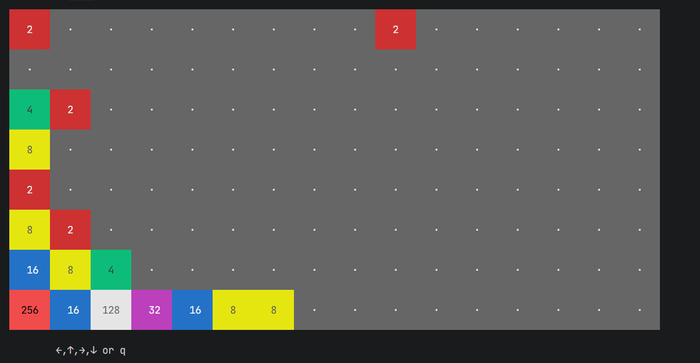

# 2048游戏 - 命令行版



## 项目说明

本项目是基于 [mevdschee/2048.c](https://github.com/mevdschee/2048.c) 的 fork 版本，进行了以下改进：

- 使用 C++ 类封装游戏核心逻辑
- 支持在单独的线程中运行游戏
- 支持自定义棋盘大小（高度和宽度）
- 添加了对外暴露的接口方法

## 游戏玩法

使用方向键（上、下、左、右）移动方块。当两个相同值的方块相撞时，它们会合并成一个值为原来两倍的方块。每次移动后，会随机生成一个值为 2 或 4 的新方块。目标是创建一个值为 2048 的方块。当棋盘填满且无法移动时，游戏结束。

## 要求

- C++ 编译器
- pthread 库（用于线程支持）

已在以下系统测试：
- GNU/Linux
- FreeBSD
- OpenBSD

## 安装

### 从源代码编译（推荐）

```bash
git clone https://github.com/johnsionFarry/2048-ai.git
cd 2048-ai
make
./2048
```

### 在 Debian 系统上安装

原始版本可以通过以下命令安装：

```bash
sudo apt install 2048
```

## 运行

### 基本运行

默认启动 4x4 棋盘的游戏：

```bash
./2048
```

### 自定义棋盘大小

可以通过命令行参数设置棋盘的高度和宽度：

```bash
# 启动 8x16 棋盘的游戏
./2048 -H 8 -W 16

# 启动 5x6 棋盘的游戏
./2048 -H 5 -W 6
```

### 颜色方案

游戏支持不同的颜色方案，取决于终端对 ANSI 88 或 256 色的支持：

- 默认颜色方案：
  ```bash
  ./2048
  ```

- 黑白颜色方案（需要 256 色支持）：
  ```bash
  ./2048 blackwhite
  ```

- 蓝红颜色方案（需要 256 色支持）：
  ```bash
  ./2048 bluered
  ```

### 其他命令

- 显示版本信息：
  ```bash
  ./2048 --version
  ```

- 显示帮助信息：
  ```bash
  ./2048 --help
  ```

- 运行测试：
  ```bash
  ./2048 test
  ```

## 游戏控制

- **方向键**：移动方块
- **q**：退出游戏
- **r**：重新开始游戏

## 技术实现

### 核心类

- `Game2048`：游戏核心类，封装了所有游戏逻辑

### 对外暴露的方法

- `uint8_t getHeight() const`：获取棋盘高度
- `uint8_t getWidth() const`：获取棋盘宽度
- `uint8_t getCellValue(uint8_t row, uint8_t col) const`：获取指定位置的方块值
- `uint8_t** getBoard() const`：获取整个棋盘的副本
- `uint32_t getScore() const`：获取当前得分

### 构建系统

使用 Makefile 构建项目，支持以下命令：

- `make`：编译项目
- `make test`：运行测试
- `make clean`：清理编译产物
- `make install`：安装到系统

## 贡献

欢迎贡献代码！在提交前，请运行测试确保代码正常工作：

```bash
./2048 test
```

## 许可证

本项目使用 MIT 许可证，详见 LICENSE 文件。